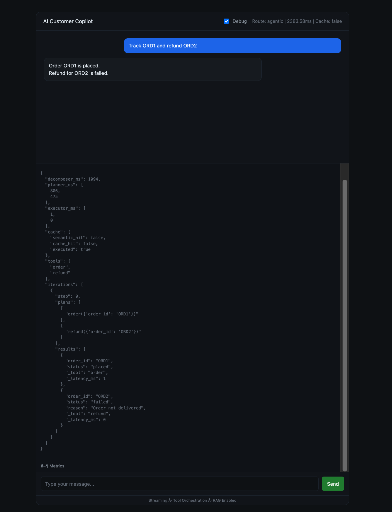
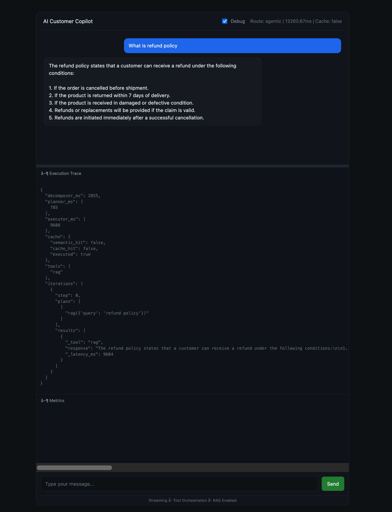
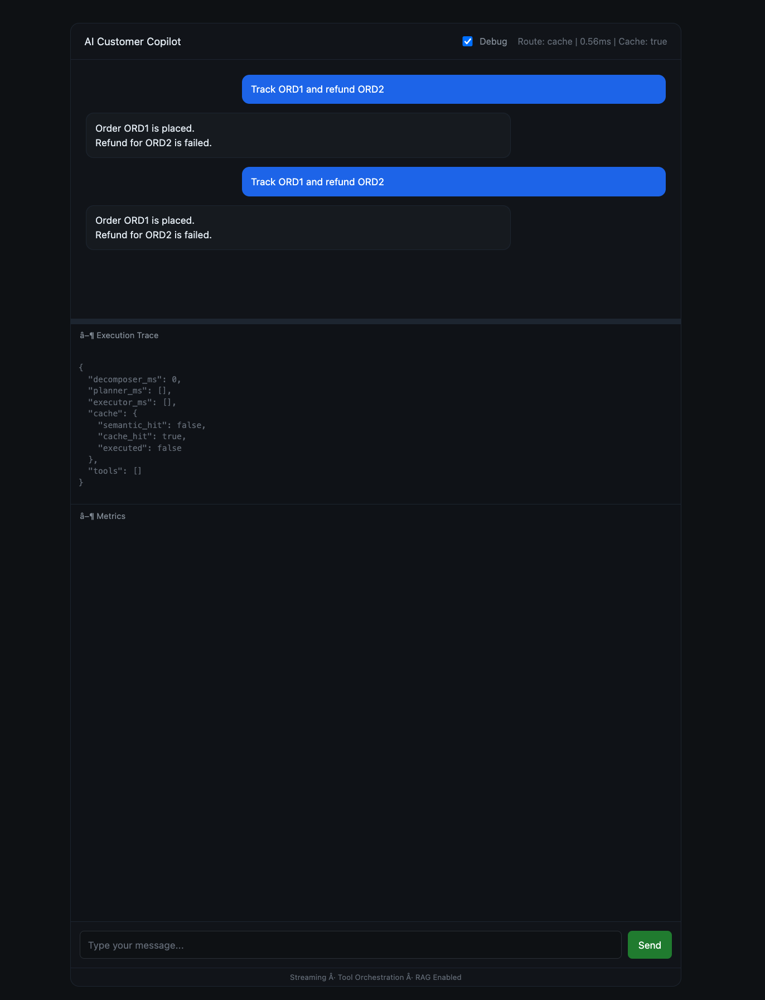
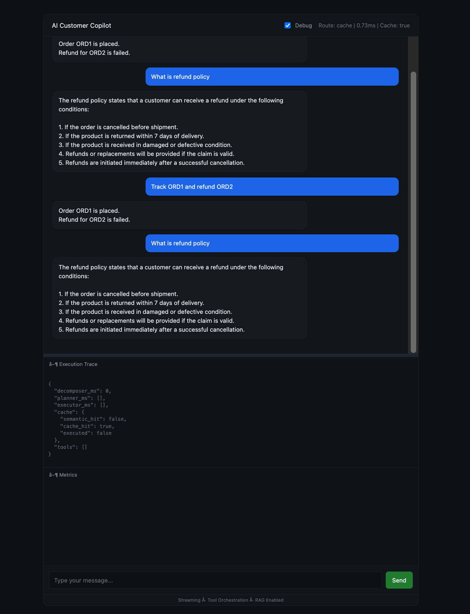
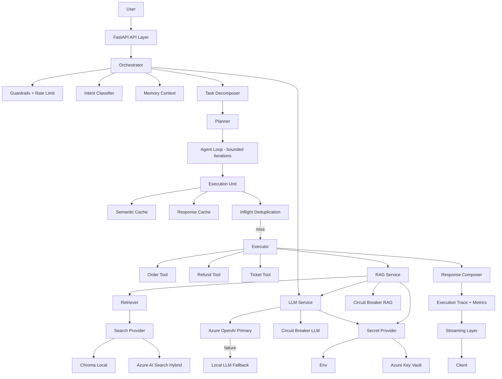

# AI Customer Support Copilot (Hybrid Deterministic AI System)


-orange)


Production-grade **deterministic AI execution system** with hybrid cloud integration (Local ↔ Azure), strict orchestration control, tool-first execution, and enterprise-ready reliability.

---


## Demo & Screens

<details open>
<summary><b>Full System Demo</b></summary>

<br>

<p align="center">
  <a href="https://github.com/areddy1805/ai-customer-copilot/releases/download/v2.0.0/demo.mp4">
    
  </a>
</p>

</details>


---


<details open>
<summary><b>Multi-Intent Orchestration</b></summary>

<br>



</details>

<details>
<summary><b>RAG Retrieval</b></summary>

<br>



</details>

<details>
<summary><b>Cache Layer</b></summary>

<br>

<p align="center">
  
  
</p>

</details>


---


## Overview

This system is a deterministic AI execution engine designed for real-world operations.

It enforces structured execution, tool grounding, and full control over LLM behavior.

Execution guarantees:

- Structured execution (planner → executor)
- Real tool invocation (orders, refunds, tickets)
- Grounded responses via controlled RAG
- Explicit execution paths (traceable + debuggable)
- Memory-aware interactions (session scoped)
- Multi-step and multi-intent handling

---

## Evolution Journey

Phase 1 — Deterministic Local System
→ Tool-first execution, local LLM, basic RAG

Phase 2 — Hybrid Architecture
→ Pluggable LLM, embeddings, retrieval abstraction

Phase 3 — Agentic Layer
→ Multi-intent planning, structured execution, framework evaluation

Phase 4 — Production Hardening
→ Caching, retries, circuit breakers, observability


---


Current Release: **v2.0 — Agentic Hybrid AI Copilot**


---


## Request Lifecycle

User → Orchestrator → Decompose → Plan → Execute → Compose → Response

- LLM is used only for decomposition and planning
- Execution is strictly tool-driven
- Every step is validated and traceable

---

## Architecture Principles

- LLM is stateless and cannot control execution
- Orchestrator is the single source of truth
- Planner defines execution path, executor enforces it
- Tools are pure deterministic functions
- RAG is bounded and cannot override system truth
- Azure services are pluggable, never authoritative
- System remains fully functional without cloud

---

## Why Not Pure Agentic Systems?

- Agent frameworks allow LLMs to control execution
- This introduces:
  - hallucinated tool calls
  - unpredictable flows
  - debugging difficulty

This system enforces:
- deterministic planning
- bounded execution
- strict tool validation

Result:
- production reliability > agent flexibility

---

## Azure Integration

Optional cloud layer:

- Azure OpenAI (LLM)
- Azure AI Search (RAG)
- Azure Embeddings
- Azure Key Vault (secrets)

All components are replaceable at runtime.

**No Azure dependency is required for system execution.**

---


## Development Branches

| Branch | Description |
|--------|------------|
| main | Hybrid production system (Azure + Local + Resilience + Agentic-ready) |
| release/v1-local | Stable deterministic local baseline |
| feature/azure-migration | Introduces Azure providers (LLM, embeddings, search) |
| feature/agentic-framework | Deterministic planner → agent evolution |
| feature/framework-adapters | LangChain / AutoGen adapters (non-core layer) |

---


## Security & Secrets

Secrets are never stored in code.

### Secret Management

- Azure Key Vault (primary)
- Environment fallback (development only)

Architecture:

Providers → SecretProvider → (Env | Key Vault)

### Key Vault Integration

- Runtime retrieval (no static storage)
- In-memory caching (latency optimized)
- Naming normalization layer for Azure constraints

---

## Core Capabilities

- Deterministic orchestration (planner → executor)
- Tool-first execution (orders, refunds, tickets)
- Hybrid LLM (Azure primary, local fallback)
- Hybrid RAG (Azure AI Search / local vector DB)
- Multi-intent + parallel execution
- Semantic + response caching
- Full observability (trace + metrics)
- Resilience (retry, timeout, circuit breaker)
- Streaming responses (SSE)

---


## Runtime Control

Providers are switchable via config:

- LLM_PROVIDER = local | azure
- EMBEDDING_PROVIDER = local | azure
- SEARCH_PROVIDER = local | azure

No code changes required.

---


## Resilience & Failure Handling

- Provider fallback (Azure → Local)
- Retry with backoff
- Timeout enforcement
- Circuit breaker isolation

---

## Architecture



---


## System Design Considerations

### Latency
- Parallel execution for multi-intent
- Streaming to reduce perceived latency

### Cost
- Azure vs Local switching
- Embedding reuse + caching

### Scalability
- Stateless API layer
- Redis for distributed memory
- Search index scaling via Azure AI Search

### Failure Handling
- circuit breakers per provider
- fallback to local LLM
- retry with backoff

---

## Provider Abstraction (Core Design)

### LLM

LLM_PROVIDER=local | azure

- Local → Ollama
- Azure → Responses API

---

### Embeddings

EMBEDDING_PROVIDER=local | azure

- Local → SentenceTransformers
- Azure → text-embedding-3-small

---

### Search Provider (RAG Backend)

SEARCH_PROVIDER=local | azure

- Local → Chroma (vector-only retrieval)
- Azure → Azure AI Search (hybrid: vector + keyword)

**Key Behavior:**

- Each provider maintains its own index
- Switching provider requires reindex
- No shared storage between providers

---

## Key Insight (From Evaluation)

System behavior:

- ~90% → Tool execution
- ~10% → RAG usage

**Implication:**

- Orchestrator dominates correctness
- RAG is selectively impactful

---

## Embedding Evaluation Result

| Query                    | Local| Azure|
|--------------------------|------|-------|
| didnt receive package    | PASS | PASS+ |
| item came broken         | PASS | PASS+ |
| shipping time            | FAIL | PASS  |
| cancel after ordering    | PASS | PASS+ |

**Conclusion**

- Azure embeddings improve semantic retrieval
- Local embeddings rely on keyword overlap
- Hybrid setup exposes measurable retrieval differences
---
---

## Benchmark: Framework vs Deterministic Execution

### Benchmark Setup

Queries tested:
- Single intent → order tracking
- Multi-intent → order + refund
- RAG query → policy retrieval

Execution modes:
- CORE (deterministic orchestrator)
- LangChain
- LangGraph
- AutoGen

---

### Results Summary

#### Local Models (Ollama)

| Mode       | Single Intent | Multi Intent | RAG Query |
|------------|--------------|--------------|-----------|
| CORE       | 13.6s        | 11.4s        | 20.2s     |
| LangChain  | 11.2s        | 11.5s        | 12.0s     |
| LangGraph  | 10.9s        | 12.1s        | 11.5s     |
| AutoGen    | 10.6s        | 11.6s        | 11.4s     |

---


#### Azure Models (GPT-4.1-mini)

| Mode       | Single Intent | Multi Intent | RAG Query |
|------------|--------------|--------------|-----------|
| CORE       | 20.2s        | 18.9s        | 20.2s     |
| LangChain  | 19.5s        | 19.3s        | 25.0s     |
| LangGraph  | 18.6s        | 20.0s        | 18.6s     |
| AutoGen    | 17.4s        | 19.9s        | 17.7s     |

---


### Key Observations

- Framework overhead is negligible (<10%)
- Latency is dominated by:
  - LLM inference
  - RAG retrieval
- Deterministic orchestration performs on par with agent frameworks
- Output differences are driven by prompting style, not architecture
---
---

## Project Structure

```
.
├── app/
│   ├── api/                  # FastAPI endpoints (chat, streaming, metrics)
│   ├── orchestrator/         # Core engine (decompose → plan → execute → agent loop)
│   ├── tools/                # Business logic (order, refund, ticket, rag)
│   ├── llm/                  # LLM abstraction (Azure + Local providers)
│   ├── rag/                  # Retrieval pipeline (chunking, indexing, retrieval)
│   ├── embeddings/           # Embedding providers (local + Azure)
│   ├── memory/               # Session memory (in-memory / Redis)
│   ├── cache/                # Response + semantic cache + inflight dedup
│   ├── security/             # Rate limit, circuit breaker, guardrails
│   ├── observability/        # Metrics, logging, execution trace
│   ├── eval/                 # Evaluation framework (accuracy + routing)
│   ├── core/                 # Config, DI container, secrets (Key Vault / env)
│   └── main.py               # Application entrypoint
│
├── services/                 # External search providers (Azure AI Search / FAISS)
│
├── data/
│   ├── mock_db/              # Orders, payments, refunds, tickets
│   ├── knowledge_base/       # RAG documents (policies, edge cases)
│   └── chroma/               # Local vector store
│
├── client/                   # Minimal UI (SSE streaming)
├── infra/                    # Docker + compose
├── scripts/                  # Reindexing + evaluation utilities
├── assets/                   # Demo + screenshots
│
├── requirements.txt
├── README.md
└── LICENSE

```

---


## Example Flows

### Single Intent
Query: Where is my order ORD1
Plan: [order]
Output: Order status + ETA

### Multi Intent
Query: Track ORD1 and refund ORD2
Plans:
- [order ORD1]
- [order ORD2 → refund ORD2]
Output: Combined deterministic response

### RAG + Streaming
Query: What is refund policy
Route: RAG
Behavior: streaming + grounded
Output: Verified response

---

## Configuration

```env
LLM_PROVIDER=local | azure
EMBEDDING_PROVIDER=local | azure
SEARCH_PROVIDER=local | azure

SECRET_PROVIDER=env | keyvault
AZURE_KEY_VAULT_URL=https://<vault>.vault.azure.net/
```

- No secrets stored locally
-	All secrets resolved at runtime

---

## Run

```bash
# install
python -m venv .venv
source .venv/bin/activate
pip install -r requirements.txt

# reindex (required)
python -m scripts.reindex

# start api
uvicorn app.main:app --reload

# start ui
cd client
python -m http.server 3000
```

### Test

```bash
curl "http://localhost:8000/api/chat?query=Track%20ORD1%20and%20refund%20ORD2"
```

---


## Evaluation

```bash
# system evaluation
python -m app.eval.eval_runner

# retriever evaluation
python -m scripts.test_retriever
```

---


## Real-World Use Cases

- E-commerce customer support automation
- Enterprise internal helpdesk systems
- Policy-compliant AI assistants
- Regulated environments requiring deterministic execution

---

## Tech Stack

### Backend
- FastAPI
- Python

### LLM Providers
- Local (Ollama)
- Azure OpenAI (Responses API)

### Retrieval (RAG)
- Local (Chroma / FAISS)
- Azure AI Search (vector + hybrid)

### Embeddings
- Local models
- Azure Embeddings

### Memory
- In-memory (dev)
- Redis (optional)

### Frontend
- Vanilla JavaScript (SSE streaming)

### Infrastructure
- Docker
- Redis
- Azure (OpenAI, AI Search, Key Vault, Blob)

---


## What Makes This Different

| Capability            | Typical Chatbot        | This System                          |
|----------------------|------------------------|--------------------------------------|
| Execution Model      | LLM-driven replies     | Deterministic orchestrator           |
| Tool Execution       | ❌ None                | ✅ Structured + validated            |
| Multi-Intent         | ❌ Single intent       | ✅ Parallel + planned execution      |
| Control Layer        | ❌ Implicit            | ✅ Planner → Executor                |
| LLM Role             | Primary decision maker | Assistive (no execution control)     |
| RAG Grounding        | Loose                  | Strict + enforced                    |
| Memory               | Basic chat history     | Structured session context           |
| Streaming            | ❌ Rare                | ✅ SSE streaming                     |
| Async Execution      | ❌ Blocking            | ✅ Fully async + parallel            |
| Observability        | Minimal                | Full trace + metrics                 |
| Caching              | ❌ None                | Semantic + response cache            |
| Resilience           | ❌ None                | Retry + timeout + circuit breaker    |
| LLM Flexibility      | Fixed provider         | Hybrid (Local ↔ Azure)               |
| Architecture         | Prompt-based           | System-driven                        |
| Production Readiness | Low                    | High                                 |
| Execution Visibility | ❌ Hidden | ✅ Full trace + metrics per request |

## Framework Independence

This system does not depend on agent frameworks (LangChain, AutoGen) for execution.

- Core logic is implemented as deterministic system components
- Frameworks are integrated only as optional adapters
- Execution control remains fully within the orchestrator

---

## Why Not Pure Agentic Systems?

Agent frameworks (LangChain, AutoGen, etc.) delegate execution control to LLMs.

This introduces:

- non-deterministic tool selection
- hallucinated execution paths
- difficult debugging and tracing

This system enforces:

- deterministic planning (planner → executor)
- strict tool validation
- bounded execution loops

Result:

- predictable behavior
- production-grade reliability
- full execution traceability

---

## Future Improvements

- Persistent memory (Redis-backed sessions)
- Cost + latency attribution per provider
- Advanced retrieval tuning (hybrid ranking optimization)
- Optional multi-agent experimentation (non-core)

---


## Tradeoffs

- Deterministic orchestration vs agent autonomy
  → Predictable execution, reduced autonomy

- Custom system vs frameworks
  → Full control and transparency, higher implementation effort

- Hybrid (Local + Azure)
  → Resilience + flexibility, added operational complexity

- Bounded agent loop
  → Prevents runaway execution, limited self-recovery

---

## Engineering Insights

### 1. Framework Choice ≠ Performance

Benchmark results show:

- switching between LangChain, LangGraph, AutoGen, or custom orchestrator
- does NOT significantly impact latency

Reason:

- LLM inference dominates execution time
- retrieval (RAG) is secondary bottleneck
- orchestration overhead is minimal

---

### 2. Deterministic Systems Are Not Slower

Contrary to common assumptions:

- deterministic orchestration matches agent frameworks in performance
- while providing significantly higher reliability and control

---

### 3. Architecture > Framework

System performance and behavior are primarily influenced by:

- model selection (local vs Azure)
- retrieval strategy (vector vs hybrid)
- prompt structure

Not by:

- agent framework choice

---

### 4. Frameworks Are Abstractions, Not Architecture

In this system:

- frameworks are treated as optional adapters
- core execution remains independent

This ensures:

- long-term maintainability
- full control over system behavior