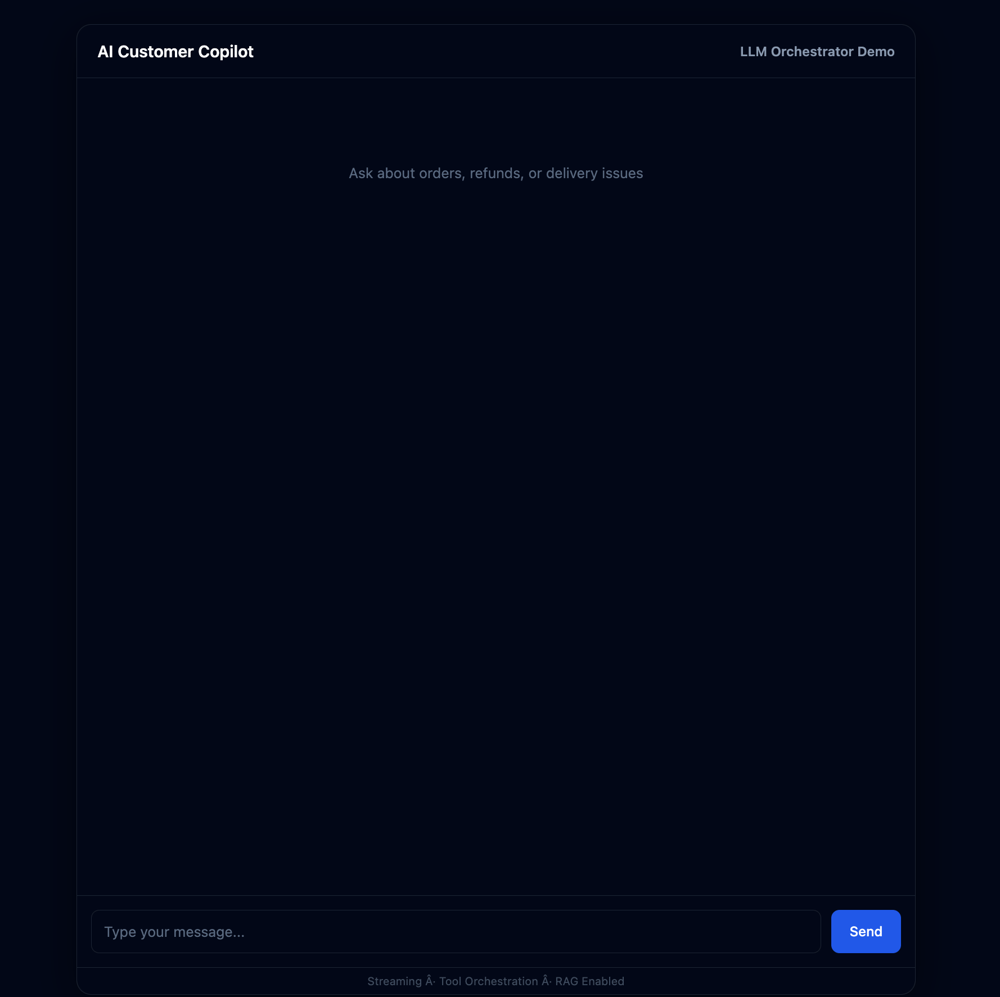
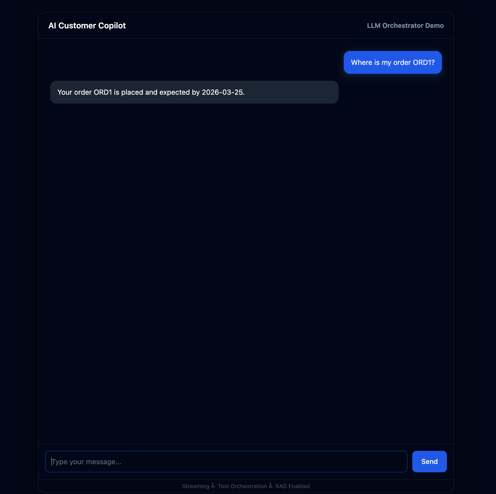
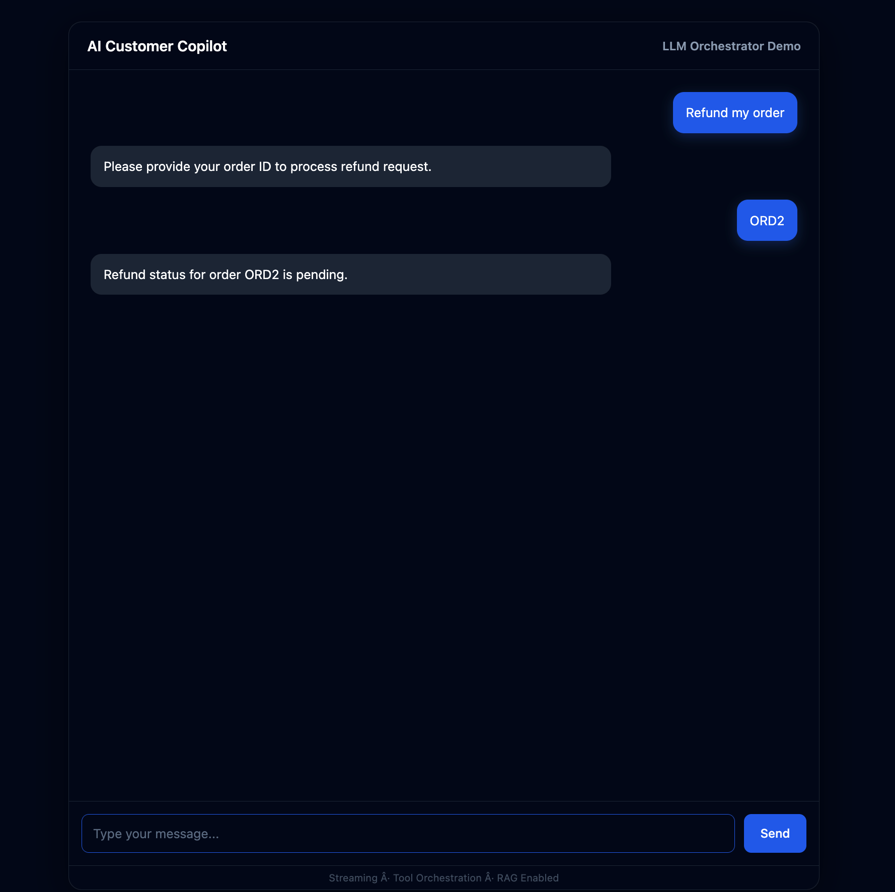
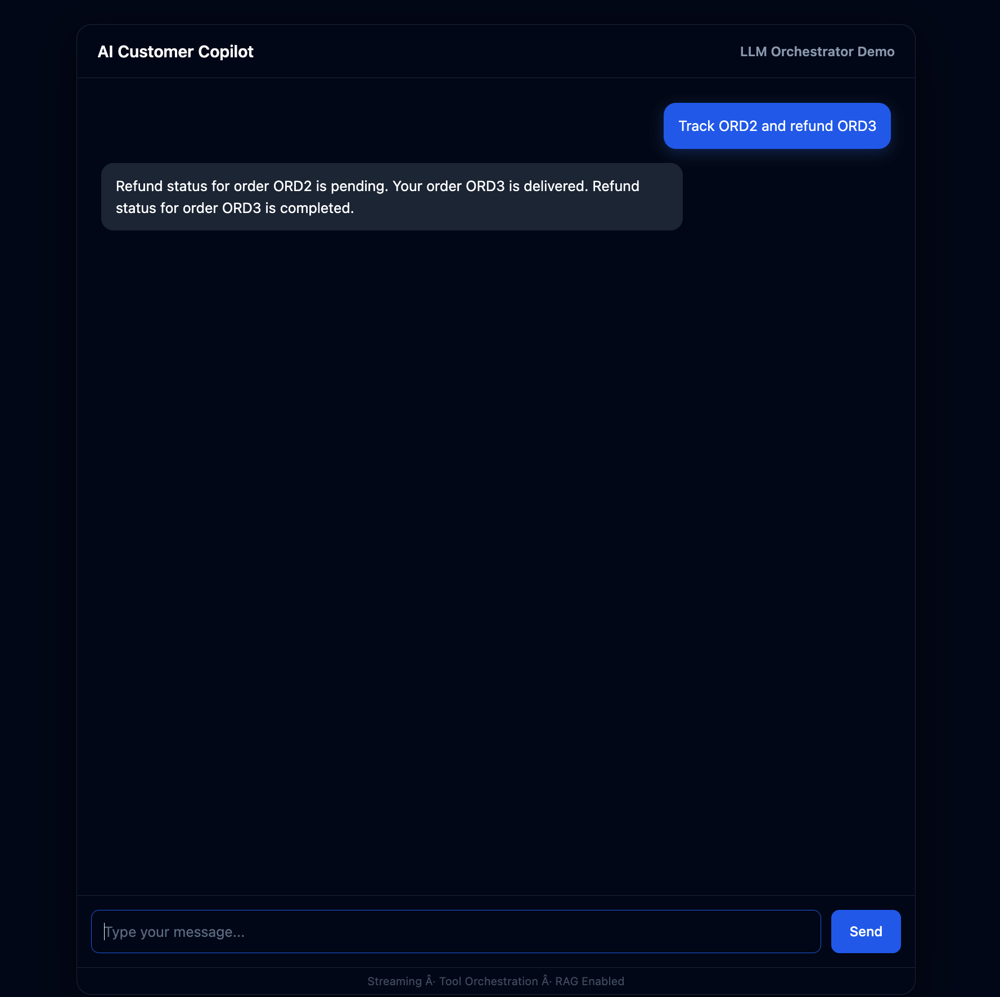
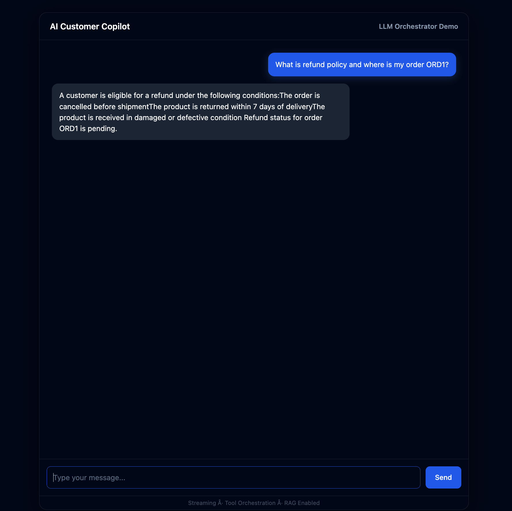
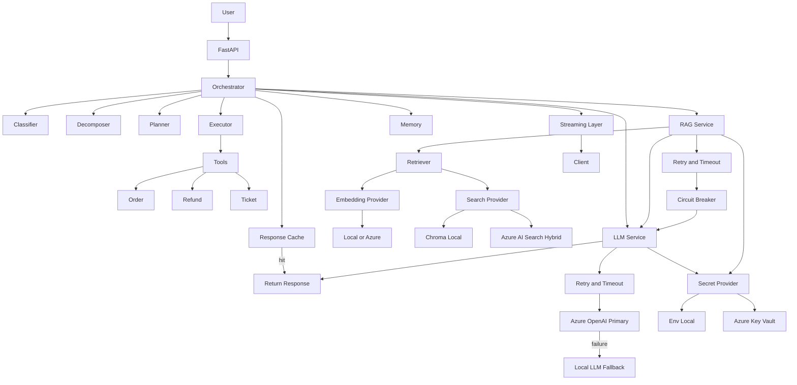

# AI Customer Support Copilot (Hybrid Azure + Local AI System)


-orange)


Production-grade AI system for e-commerce customer support with **deterministic orchestration, hybrid LLM architecture, Azure-native integrations, and controlled RAG execution**.

---

## 🎥 Demo

[](https://files.catbox.moe/y608uh.mp4)

## ⬇️ Download: https://github.com/areddy1805/ai-customer-copilot/releases/download/v1.0/demo.mp4

## Screenshots

<table>
<tr>
<td></td>
<td></td>
</tr>
<tr>
<td></td>
<td></td>
</tr>
<tr>
<td colspan="2"></td>
</tr>
</table>

## Overview

This is not a chatbot.

This is a **controlled AI execution system** where:

- LLMs assist, never control
- Orchestrator owns all decisions
- Tools execute business logic deterministically
- RAG augments responses, not authority
- Azure services are optional, pluggable components

---

## Security & Secrets

Secrets are not stored in code or config.

### Secret Management

- Azure Key Vault (primary)
- Env-based fallback (local development only)

### Supported Secret Providers

SECRET_PROVIDER=env | keyvault

Architecture:

Providers → SecretProvider → (Env OR Key Vault)

### Key Vault Integration

- Secrets fetched at runtime
- In-memory caching (no repeated network calls)
- No secrets in `.env` (production mode)

### Naming Constraint Handling

Azure Key Vault does not support underscores.

Internal mapping layer converts:

AZURE_OPENAI_API_KEY → azure-openai-api-key

## SYSTEM EVOLUTION

### BEFORE
- Local LLM (Ollama)
- Local embeddings
- Chroma vector DB

### NOW (HYBRID)
- Secrets → Azure Key Vault (secure, runtime retrieval)
- LLM → Azure (primary) + Local (automatic fallback)
- Resilience → Retry + Timeout + Circuit Breaker enforced
- Response Cache → request-level caching (Redis/in-memory)

---

## Core Capabilities

### Deterministic Orchestration
- Planner → Executor pipeline
- No direct LLM tool execution
- Guaranteed execution correctness

### Hybrid LLM Layer
- Azure OpenAI (primary)
- Ollama (automatic fallback)
- Retry + timeout enforced on Azure calls
- Circuit breaker prevents cascading failures

Behavior:

Azure success → used
Azure failure → automatic fallback to local

### Hybrid Embeddings
- Local: SentenceTransformers
- Azure: text-embedding-3-small
- Config-driven switching

### RAG (Controlled + Hybrid Retrieval)
- Retriever + strict grounding
- LLM cannot override retrieved facts
- Post-response enforcement
- Backend: Chroma OR Azure AI Search
- Azure enables hybrid retrieval (vector + keyword)

### Async + Streaming
- Fully async pipeline
- SSE streaming for responses
- Parallel execution for multi-intent

### Multi-Intent Execution
- Query decomposition
- Parallel tool execution
- Deterministic aggregation

### Tool Layer (Pure Functions)
- Order tracking
- Refund processing
- Ticket creation

### Memory Layer
- Session-scoped context
- Extendable to Redis

### Guardrails
- Input validation
- Prompt injection protection
- Execution safety

### Resilience Layer

- Retry with exponential backoff (Azure calls)
- Timeout enforcement (prevents hanging requests)
- Circuit breaker (failure isolation)
- Automatic fallback (Azure → Local)

Ensures system never fails due to external dependency.

---

## Architecture



---

Provider Abstraction (Core Design)

LLM

LLM_PROVIDER=local | azure

	•	Local → Ollama
	•	Azure → Responses API

---

Embeddings

EMBEDDING_PROVIDER=local | azure

	•	Local → SentenceTransformers
	•	Azure → text-embedding-3-small

---

Search Provider (RAG Backend)

SEARCH_PROVIDER=local | azure

• Local → Chroma (vector-only retrieval)
• Azure → Azure AI Search (hybrid: vector + keyword)

Key Behavior:
• Each provider maintains its own index
• Switching provider requires reindex
• No shared storage between providers

---

Key Insight (From Evaluation)

System behavior:

~90% → Tool execution
~10% → RAG usage

Implication:
	•	Orchestrator dominates correctness
	•	RAG quality matters only when invoked

---

Embedding Evaluation Result

Query	Local	Azure
didnt receive package	PASS	PASS+
item came broken	PASS	PASS+
shipping time	FAIL	PASS
cancel after ordering	PASS	PASS+

Conclusion
	•	Azure embeddings improve semantic retrieval
	•	Local embeddings rely on keyword overlap
	•	System now exposes real retrieval differences

---

## Project Structure

```

.
├── app/
│ ├── api/ # FastAPI endpoints (chat, health)
│ ├── orchestrator/ # Core brain (planning, execution, routing)
│ │ ├── orchestrator.py
│ │ ├── planner.py
│ │ ├── executor.py
│ │ ├── decomposer.py
│ │ ├── classifier.py
│ │ └── ...
│ ├── tools/ # Business logic (order, refund, ticket)
│ ├── rag/ # Retrieval system (embeddings, vector store)
│ ├── memory/ # Session memory (Redis/local)
│ ├── guard/ # Validation + safety layer
│ ├── cache/ # Response + semantic caching
│ ├── security/ # Rate limiting, circuit breaker, concurrency
│ ├── observability/ # Metrics + logging
│ ├── llm/ # provider abstraction (Azure / Ollama) /LLM client + prompt layer
│ ├── eval/ # Evaluation framework
│ ├── core/ # Config + logging setup
│ └── main.py # Entry point
│
├── client/ # UI (HTML/CSS/JS)
│ ├── index.html
│ └── app.js
|
├── data/
│ ├── mock_db/ # Mock business data (orders, refunds, tickets)
│ ├── knowledge_base/ # Policy documents for RAG
│ └── chroma/ # Vector store (auto-generated)
│
├── infra/
│ ├── Dockerfile
│ └── docker-compose.yml
|
├── assets/ # screenshots + demo video
│ ├── ui.png
│ ├── stream.png
│ ├── slot.png
│ ├── multi.png
│ ├── rag_tool.png
│ └── demo.mp4
│
├── scripts/ # Utility scripts
├── tests/ # Test cases
├── requirements.txt
└── README.md

```

---

## Key Design Decisions

### 1. No Direct LLM Control

LLM is not allowed to:

- call tools
- decide execution
- modify system state

All decisions are orchestrator-controlled.

---

### 2. Planner-Centric Execution

Planner defines execution path.
Router only assists.

---

### 3. Stateless Tools + Stateful Orchestrator

- Tools = pure functions
- Orchestrator = state + control

---

### 4. Async + Parallel by Default

- Multi-intent → parallel execution
- Streaming → non-blocking
- System remains responsive under load

---

### 5. Multi-Step Execution as First-Class Citizen

Every query is treated as:

Query → Tasks → Plans → Execution

---

## Example Flows

### Single Intent

Where is my order ORD1?
→ Plan: [order]
→ Response: Order status + ETA

### Multi Intent

Track ORD1 and refund ORD2
→ Plans:
[order ORD1]
[order ORD2 → refund ORD2]

→ Response:
Order + Refund combined (deterministic order)

### RAG + Streaming

What is refund policy

→ Routed to RAG
→ LLM streams tokens
→ Grounded response enforced

→ Response:
Grounded response

---

---

Configuration

.env (control only — no secrets)

```text
LLM_PROVIDER=local | azure
EMBEDDING_PROVIDER=local | azure
SEARCH_PROVIDER=local | azure

SECRET_PROVIDER=env | keyvault
AZURE_KEY_VAULT_URL=https://<vault>.vault.azure.net/
```

Note:

- Azure secrets must NOT be stored in `.env`
- All secrets are fetched from Azure Key Vault in production mode

---

Runtime Visibility

Logs active providers at startup:

[CONFIG] LLM_PROVIDER=local
[CONFIG] EMBEDDING_PROVIDER=azure
[CONFIG] SEARCH_PROVIDER=azure


---

Running

1. Install

python -m venv .venv
source .venv/bin/activate
pip install -r requirements.txt


---

2. Reindex (CRITICAL)

python -m scripts.reindex

Must be run after:
	•	embedding switch
	•	knowledge base change
  • search provider switch (local ↔ azure)

---

3. Run API

uvicorn app.main:app --reload


---

4. Run UI

cd client
python -m http.server 3000


---

5. Test

curl "http://localhost:8000/api/chat?query=Track%20ORD1%20and%20refund%20ORD2"


---

Evaluation

System Eval

python -m app.eval.eval_runner

Validates:
	•	intent classification
	•	tool routing
	•	execution correctness

---

Retriever Eval

python -m scripts.test_retriever

Validates:
	•	embedding quality
	•	semantic retrieval
	•	chunk relevance

---

## Evaluation System

Custom evaluation framework validates:

- Intent classification
- Response correctness
- Route selection (tool vs rag)
- Multi-step plan generation

Run:

```text
python -m app.eval.eval_runner
```

---

## Running Locally

1. Setup Environment

```text
python -m venv .venv
source .venv/bin/activate
pip install -r requirements.txt
```


---

2. Docker Setup

Start Full Stack

docker-compose -f infra/docker-compose.yml up --build

Services
	•	API → http://localhost:8000
	•	Redis → localhost:6379
	•	Postgres → localhost:5432
	•	Ollama → http://localhost:11434

---

Pull LLM Model

docker exec -it copilot-ollama ollama pull phi3


---

Stop

docker-compose -f infra/docker-compose.yml down


---

3. Run API (Without Docker)

uvicorn app.main:app --reload


---

4. Start UI

cd client
python -m http.server 3000

Open:

http://localhost:3000


---

5. Test via API

curl "http://localhost:8000/api/chat?query=Track%20ORD1%20and%20refund%20ORD2"


---

Tech Stack

Backend
	•	FastAPI
	•	Python

LLM
	•	Azure OpenAI
	•	Ollama (phi3, mistral, llama3, qwen)

Retrieval (RAG)
  • Chroma (local vector DB)
  • Azure AI Search (hybrid retrieval: vector + keyword)

Memory & State
	•	In-memory session store (extensible to Redis)

Frontend
	•	Vanilla JavaScript
	•	HTML / CSS
	•	Server-Sent Events (SSE) for streaming

Infrastructure (Optional)
	•	Docker
	•	Redis (for scaling memory/queues)

---

## What Makes This Different

| Feature                | Chatbot | This System |
|------------------------|---------|-------------|
| Tool execution         | ❌      | ✅           |
| Deterministic flow     | ❌      | ✅           |
| Multi-intent support   | ❌      | ✅           |
| Async execution        | ❌      | ✅           |
| Streaming 		     | ❌      | ✅           |
| Memory                 | Limited | Structured  |
| RAG grounding          | Partial | Integrated  |
| Production readiness   | Low     | High        |
| Pluggable LLMs 	     | ❌      | ✅           |
| Observability          | Minimal | Integrated  |
| Safety / Guardrails    | Weak    | Enforced    |
| Production readiness   | Low	   | High        |


---

## Design Rules (Enforced)
	•	LLM cannot execute tools
	•	LLM cannot modify system state
	•	Tools are pure functions
	•	Orchestrator is the only decision layer
	•	RAG is assistive, not authoritative
	•	Azure is optional, not required

---

## Tradeoffs

Dimension	Local	Azure
Latency	Low	Higher
Cost	Zero	Per-token
Control	Full	Limited
Quality	Moderate	High
Reliability	Depends on hardware	Managed


---

## Current State

Layer	Status
Orchestrator	Stable
Tool Execution	Stable
LLM Control	Stable (with fallback)
Embeddings	Hybrid
RAG	Active
Evaluation	Valid (100% pass)
Azure Integration	Complete
Security	Key Vault integrated
Resilience	Retry + Timeout + Circuit Breaker active
Caching	Response cache active

---

## Hybrid Retrieval Architecture

The system supports interchangeable retrieval backends:

• Local (Chroma) → fast, vector-only
• Azure AI Search → hybrid (vector + keyword)

Key Insight:
Azure improves recall and semantic matching in real-world queries,
especially where keyword mismatch occurs.

Tradeoff:
Higher latency + cost vs improved accuracy.

---

## System Hardening (Implemented)

### Caching

- Response-level caching
- Avoids repeated execution for identical queries

### Retry

- Exponential backoff for Azure calls
- Handles transient failures

### Timeout

- Prevents long-running requests
- Ensures system responsiveness

### Circuit Breaker

- Opens on repeated failures
- Prevents cascading outages

### Fallback

- Azure → Local fallback (LLM)
- System remains operational during outages

---

## Key Insight (Production Behavior)

Observed behavior:

- Tool execution → dominant (~90%)
- RAG usage → selective (~10%)

Implication:

- System reliability depends more on orchestration than LLM quality
- Resilience mechanisms are critical for real-world deployment

---

License

MIT License
