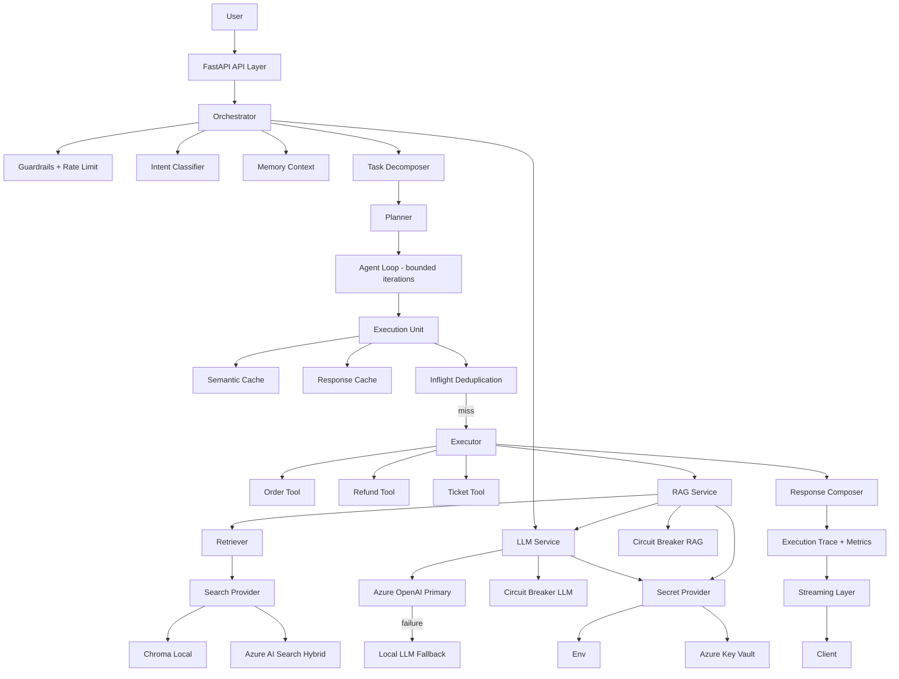

# AI Customer Support Copilot (Hybrid Deterministic AI System)


-orange)


Production-grade **deterministic AI execution system** with hybrid cloud integration (Local ↔ Azure), strict orchestration control, tool-first execution, and enterprise-ready reliability.

---

## 🎥 Demo

[](https://files.catbox.moe/y608uh.mp4)

## ⬇️ Download: https://github.com/areddy1805/ai-customer-copilot/releases/download/v1.0/demo.mp4

## Screenshots

<table>
<tr>
<td></td>
<td></td>
</tr>
<tr>
<td></td>
<td></td>
</tr>
<tr>
<td colspan="2"></td>
</tr>
</table>

## Overview

This is not a chatbot.

This is a **deterministic AI system** designed to execute real-world operations with full control over LLM behavior.

System guarantees:

- Structured execution (planner → executor)
- Real tool invocation (orders, refunds, tickets)
- Grounded responses via controlled RAG
- Explicit execution paths (traceable + debuggable)
- Memory-aware interactions (session scoped)
- Multi-step and multi-intent handling

LLMs are used as **assistive components**, not decision-makers.

---

## Architecture Principles

- LLM is stateless and **cannot control execution**
- Orchestrator is the **single source of truth**
- Tools are **pure, deterministic functions**
- RAG is **strictly bounded and enforceable**
- Azure services are **plug-in layers, not dependencies**
- System remains **fully operational without cloud**

---

## Azure Integration

Azure is integrated as a **replaceable execution layer**, not a requirement.

- Azure OpenAI (Responses API)
- Azure AI Search (vector + hybrid retrieval)
- Azure Embeddings (semantic search improvement)
- Azure Key Vault (secure runtime secrets)
- Azure Blob Storage (planned for documents + transcripts)

---

## Branches

| Branch | Description |
|--------|------------|
| main | Hybrid production system (Azure + Local + Resilience + Agentic-ready) |
| release/v1-local | Stable deterministic local baseline |
| feature/azure-migration | Introduces Azure providers (LLM, embeddings, search) |
| feature/agentic-framework | Deterministic planner → agent evolution |
| feature/framework-adapters | LangChain / AutoGen adapters (non-core layer) |

---

## Agentic Implementations (WIP)

| Mode | Description |
|------|------------|
| Core Agent (Custom) | Deterministic planner with structured execution |
| LangChain Adapter | Framework integration (non-authoritative) |
| AutoGen Adapter | Multi-agent experimentation |

---

## Security & Secrets

Secrets are never stored in code.

### Secret Management

- Azure Key Vault (primary)
- Environment fallback (development only)

Architecture:

Providers → SecretProvider → (Env | Key Vault)

### Key Vault Integration

- Runtime retrieval (no static storage)
- In-memory caching (latency optimized)
- Naming normalization layer for Azure constraints

---

## SYSTEM EVOLUTION

### BEFORE (LOCAL SYSTEM)
- Ollama (LLM)
- Local embeddings
- Chroma vector DB

### NOW (HYBRID SYSTEM)
- LLM → Azure (primary) + Local fallback
- Embeddings → Azure or Local (config-driven)
- Search → Azure AI Search (hybrid) or Local
- Secrets → Key Vault (secure runtime)
- Resilience → retry, timeout, circuit breaker
- Cache → request-level + semantic caching

System transitioned from **prototype → production-grade architecture**.

---

## Core Capabilities

### Deterministic Orchestration
- Planner → Executor pipeline
- No LLM-driven execution
- Fully predictable behavior

---

### Hybrid LLM Layer
- Azure OpenAI (primary execution)
- Ollama (fallback)
- Circuit breaker + retry + timeout enforced

Execution behavior:

- Azure success → used
- Azure failure → automatic local fallback

---

### Hybrid Embeddings
- Local → SentenceTransformers
- Azure → text-embedding-3-small
- Switchable without code changes

---

### RAG (Controlled Retrieval System)
- Strict grounding enforcement
- LLM cannot override retrieved facts
- Backend:
  - Local → Chroma (vector)
  - Azure → AI Search (hybrid: vector + keyword)

---

### Async + Streaming
- Fully async architecture
- SSE streaming responses
- Non-blocking execution

---

### Multi-Intent Execution
- Query decomposition
- Parallel execution
- Deterministic aggregation

---

### Tool Layer (Execution Core)
- Order tracking
- Refund processing
- Ticket creation

Tools remain:
- Stateless
- Deterministic
- Fully testable

---

### Memory Layer
- Session-based memory
- Extendable to Redis / persistent storage

---

### Guardrails
- Input validation
- Prompt injection protection
- Execution safety enforcement

---

### Resilience Layer

- Retry (exponential backoff)
- Timeout enforcement
- Circuit breaker (failure isolation)
- Automatic fallback (Azure → Local)

System guarantees **no external dependency failure propagates to user experience**.

---

## Hybrid Execution Control

All providers are runtime switchable:

- LLM_PROVIDER = local | azure
- EMBEDDING_PROVIDER = local | azure
- SEARCH_PROVIDER = local | azure

No code changes required.

---

## System Positioning

This system is:

- A **deterministic AI execution engine**
- A **hybrid cloud AI architecture**
- A **production-ready copilot foundation**

This system is not:

- a prompt-driven chatbot
- an LLM-controlled agent
- a framework-dependent implementation

---

## Execution Transparency

- Every request produces a **visible execution plan**
- Plans are **loggable, inspectable, reproducible**
- Debugging occurs at **step-level granularity**

---

## Resilience & Failure Handling

- Provider-level fallback (Azure → Local)
- Tool-level retry logic
- Timeout + circuit breaker isolation
- System degrades gracefully, never collapses

---

## Architecture



---

## Provider Abstraction (Core Design)

### LLM

LLM_PROVIDER=local | azure

- Local → Ollama
- Azure → Responses API

---

### Embeddings

EMBEDDING_PROVIDER=local | azure

- Local → SentenceTransformers
- Azure → text-embedding-3-small

---

### Search Provider (RAG Backend)

SEARCH_PROVIDER=local | azure

- Local → Chroma (vector-only retrieval)
- Azure → Azure AI Search (hybrid: vector + keyword)

**Key Behavior:**

- Each provider maintains its own index
- Switching provider requires reindex
- No shared storage between providers

---

## Key Insight (From Evaluation)

System behavior:

- ~90% → Tool execution
- ~10% → RAG usage

**Implication:**

- Orchestrator dominates correctness
- RAG is selectively impactful

---

## Embedding Evaluation Result

| Query                    | Local| Azure|
|--------------------------|------|-------|
| didnt receive package    | PASS | PASS+ |
| item came broken         | PASS | PASS+ |
| shipping time            | FAIL | PASS  |
| cancel after ordering    | PASS | PASS+ |

**Conclusion**

- Azure embeddings improve semantic retrieval
- Local embeddings rely on keyword overlap
- Hybrid setup exposes measurable retrieval differences

---

## Project Structure

```
.
├── app/
│   ├── api/                  # FastAPI endpoints (chat, streaming, metrics)
│   ├── orchestrator/         # Core engine (decompose → plan → execute → agent loop)
│   ├── tools/                # Business logic (order, refund, ticket, rag)
│   ├── llm/                  # LLM abstraction (Azure + Local providers)
│   ├── rag/                  # Retrieval pipeline (chunking, indexing, retrieval)
│   ├── embeddings/           # Embedding providers (local + Azure)
│   ├── memory/               # Session memory (in-memory / Redis)
│   ├── cache/                # Response + semantic cache + inflight dedup
│   ├── security/             # Rate limit, circuit breaker, guardrails
│   ├── observability/        # Metrics, logging, execution trace
│   ├── eval/                 # Evaluation framework (accuracy + routing)
│   ├── core/                 # Config, DI container, secrets (Key Vault / env)
│   └── main.py               # Application entrypoint
│
├── services/                 # External search providers (Azure AI Search / FAISS)
│
├── data/
│   ├── mock_db/              # Orders, payments, refunds, tickets
│   ├── knowledge_base/       # RAG documents (policies, edge cases)
│   └── chroma/               # Local vector store
│
├── client/                   # Minimal UI (SSE streaming)
├── infra/                    # Docker + compose
├── scripts/                  # Reindexing + evaluation utilities
├── assets/                   # Demo + screenshots
│
├── requirements.txt
├── README.md
└── LICENSE

```

---

## Key Design Decisions

### 1. No Direct LLM Control

LLM is not allowed to:

- call tools
- decide execution
- modify system state

All decisions are orchestrator-controlled.

---

### 2. Planner-Centric Execution

- Planner defines execution path
- Executor enforces deterministic behavior

---

### 3. Stateless Tools + Stateful Orchestrator

- Tools = pure functions
- Orchestrator = state + control

---

### 4. Async + Parallel by Default

- Multi-intent → parallel execution
- Streaming → non-blocking
- System remains responsive under load

---

### 5. Multi-Step Execution as First-Class Citizen

Every query is treated as:

Query → Tasks → Plans → Execution

---

### 6. Execution Guarantees

- Every tool call is explicitly planned and validated
- No implicit LLM-triggered actions
- All execution paths are traceable and reproducible

---

## Example Flows

### Single Intent

Where is my order ORD1

→ Plan: [order]
→ Response: Order status + ETA

---

### Multi Intent

Track ORD1 and refund ORD2

→ Plans:
[order ORD1]
[order ORD2 → refund ORD2]

→ Response: Combined deterministic output

---

### RAG + Streaming

What is refund policy

→ Routed to RAG
→ LLM streams tokens
→ Grounding enforced

→ Response: Verified grounded output

---

## Configuration

.env (control only — no secrets)

```text
LLM_PROVIDER=local | azure
EMBEDDING_PROVIDER=local | azure
SEARCH_PROVIDER=local | azure

SECRET_PROVIDER=env | keyvault
AZURE_KEY_VAULT_URL=https://<vault>.vault.azure.net/
```

Note:

- Azure secrets must NOT be stored in `.env`
- All secrets are fetched from Azure Key Vault in production mode

---

Runtime Visibility

Logs active providers at startup:

[CONFIG] LLM_PROVIDER=local
[CONFIG] EMBEDDING_PROVIDER=azure
[CONFIG] SEARCH_PROVIDER=azure


---

Running

1. Install

python -m venv .venv
source .venv/bin/activate
pip install -r requirements.txt


---

2. Reindex (CRITICAL)

python -m scripts.reindex

Must be run after:
	•	embedding switch
	•	knowledge base change
  • search provider switch (local ↔ azure)

---

3. Run API

uvicorn app.main:app --reload


---

4. Run UI

cd client
python -m http.server 3000


---

5. Test

curl "http://localhost:8000/api/chat?query=Track%20ORD1%20and%20refund%20ORD2"


---

Evaluation

System Eval

python -m app.eval.eval_runner

Validates:
	•	intent classification
	•	tool routing
	•	execution correctness

---

Retriever Eval

python -m scripts.test_retriever

Validates:
	•	embedding quality
	•	semantic retrieval
	•	chunk relevance

---

## Evaluation System

Custom evaluation framework validates:

- Intent classification
- Response correctness
- Route selection (tool vs rag)
- Multi-step plan generation

Run:

```bash
python -m app.eval.eval_runner
```

---

## Running Locally

1. Setup Environment

```text
python -m venv .venv
source .venv/bin/activate
pip install -r requirements.txt
```


---

2. Docker Setup

Start Full Stack

docker-compose -f infra/docker-compose.yml up --build

Services
	•	API → http://localhost:8000
	•	Redis → localhost:6379
	•	Postgres → localhost:5432
	•	Ollama → http://localhost:11434

---

Pull LLM Model

docker exec -it copilot-ollama ollama pull phi3


---

Stop

docker-compose -f infra/docker-compose.yml down


---

3. Run API (Without Docker)

uvicorn app.main:app --reload


---

4. Start UI

cd client
python -m http.server 3000

Open:

http://localhost:3000


---

5. Test via API

curl "http://localhost:8000/api/chat?query=Track%20ORD1%20and%20refund%20ORD2"


---

## Tech Stack

### Backend
- FastAPI
- Python

### LLM Providers
- Local (Ollama)
- Azure OpenAI (Responses API)

### Retrieval (RAG)
- Local (Chroma / FAISS)
- Azure AI Search (vector + hybrid)

### Embeddings
- Local models
- Azure Embeddings

### Memory
- In-memory (dev)
- Redis (optional)

### Frontend
- Vanilla JavaScript (SSE streaming)

### Infrastructure
- Docker
- Redis
- Azure (OpenAI, AI Search, Key Vault, Blob)

---

## What Makes This Different

| Capability            | Typical Chatbot        | This System                          |
|----------------------|------------------------|--------------------------------------|
| Execution Model      | LLM-driven replies     | Deterministic orchestrator           |
| Tool Execution       | ❌ None                | ✅ Structured + validated            |
| Multi-Intent         | ❌ Single intent       | ✅ Parallel + planned execution      |
| Control Layer        | ❌ Implicit            | ✅ Planner → Executor                |
| LLM Role             | Primary decision maker | Assistive (no execution control)     |
| RAG Grounding        | Loose                  | Strict + enforced                    |
| Memory               | Basic chat history     | Structured session context           |
| Streaming            | ❌ Rare                | ✅ SSE streaming                     |
| Async Execution      | ❌ Blocking            | ✅ Fully async + parallel            |
| Observability        | Minimal                | Full trace + metrics                 |
| Caching              | ❌ None                | Semantic + response cache            |
| Resilience           | ❌ None                | Retry + timeout + circuit breaker    |
| LLM Flexibility      | Fixed provider         | Hybrid (Local ↔ Azure)               |
| Architecture         | Prompt-based           | System-driven                        |
| Production Readiness | Low                    | High                                 |

## Framework Independence

This system does not depend on agent frameworks (LangChain, AutoGen) for execution.

- Core logic is implemented as deterministic system components
- Frameworks are integrated only as optional adapters
- Execution control remains fully within the orchestrator

---

## Future Improvements

- LLM-assisted planner (replace rule-based decomposition with structured planning)
- LangChain adapter (framework interoperability for comparison/demo)
- AutoGen multi-agent layer (experimental, non-core)
- Persistent memory (Redis-backed sessions)
- Basic cost + latency tracking (per-provider visibility)

### Scope:

1. LangChain / LangGraph
	•	Wrap existing orchestrator as a tool
	•	Show graph-based execution vs your planner
	•	No replacement of core system

2. AutoGen
	•	Simulate multi-agent interaction
	•	Keep it isolated (demo layer only)
	•	No production coupling

---

## Tradeoffs

- Deterministic orchestration vs agent autonomy
  → Reliable execution, limited flexibility

- Custom system vs frameworks
  → Full control and transparency, higher implementation effort

- Hybrid (Local + Azure)
  → Resilience + flexibility, added operational complexity

- Bounded agent loop
  → Prevents runaway execution, limited self-recovery

---

MIT License

